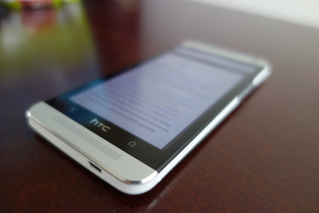
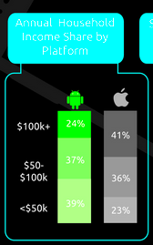
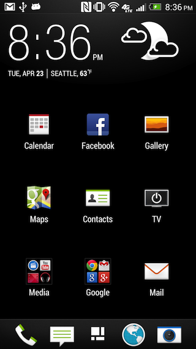

{{{
  "title" : "HTC One Review",
  "date": "4-23-2013"
}}}

Leading up to the release of the HTC One, I was quite excited. From the early photos I'd seen of it, the production quality and attention to detail
on the industrial design seemed rival that of Apple's iPhone. Of course, I was pleased by the hardware specs, but that wasn't really the main
selling point for me:

##### Hardware

Hardware is becoming commoditized, at least relatively to the software running on it. Two years ago, all the OEMs were blazing a trail, obsoleting their own
products within a matter months. This is quite similar to the PC era circa 10-15 years ago, where every manufacturer was vying to have more megahertz and gigabits.
Now, most consumers probably don't even care about the specs on their PC so much as the price point. For every day user needs, even the _slowest_ PC
is fast enough.

Hardware innovation outpacing software complexity is following suit on mobile devices-- even mid tier phones can run the Android OS and apps just fine.
And the hardware differentiation at the top end of the mobile phone spectrum is minimal as well. Going forward, software and services will become the
value add on top of a OEM's offering.

The point being, I don't feel the hardware specs really differentiate the top end phones. That said, the HTC One still manages to set itself apart from
the other offerings currently on the market by boasting a shiny 1080p display. It's the sharpest display I've seen on a phone to date.
I've also geeking out with the on board TV Remote (powered by [Peel](http://www.engadget.com/2010/12/08/peel-turns-your-iphone-into-a-universal-remote-using-a-wirele/)).

I won't be doing any benchmarks in this review, because they are silly.

> The only users that care about benchmarks are the users running benchmarks.

In short, the hardware is incredible, and easily the best of breed on the market. It is  an iterative improvement over the Nexus 4 and nearly
exactly the same as the Samsung Galaxy S4. In The Future, software will matter more than hardware.

##### No SD Card?

This may be a "deal breaker" for some people, but I don't even take this into consideration when buying a phone anymore.
SD Cards are clunky. Internal phone storage has plenty of space, and cloud storage makes your data capacity effectively
unlimited.

##### Industrial Design

I've alluded to what I think matters to the end user: software and industrial design.
These pieces of carved aluminum and glass are status symbols, they are fashion accessories. They should be beautiful and feel expensive.
Phones are luxury items. They are jewelry. They are the new rims you put on your car. Functionally, the aesthetics serve no purpose, yet
they matter nonetheless.

Vain, I know, but such is reality. Take a look at the [chart](http://www.comscore.com/Insights/Blog/Android_vs_iOS_User_Differences_Every_Developer_Should_Know#imageview/0/) below. I wouldn't say that Apple makes better
phones anymore, but they command a larger market share at the higher income brackets.
  

That said, the HTC One is now the most beautiful phone on the market. It's prettier than my iPhone. You can tell that
somewhere, a design team worked around the clock to get every edge, angle, and surface perfect.

The phone is seamless. Literally. I can't figure out how to open it. Not that I care to.

##### Software

I haven't used Sense for a couple versions. Earlier iterations were bulky and clunky, the phone would barely chug along. I can't believe I'm saying this,
but Sense 5 is _Not That Bad_. I think that having such a higher resolution display allowed the design team to no longer
limit themselves to device constraints, and allow their visions as prototyped in Photoshop to become a reality.

The Sense Home widgets and feeds are nice, and surprisingly usable. Everything feels smooth and snappy. The animations are subtle, not overdone.

> And then there's the Sense App Drawer...

The Sense home screen is not bad, but as mentioned in other reviews, the app drawer renders it nearly unusable...
it only houses a 3x3 grid of icons. That isn't nearly enough being shown on the page to actually find an app once you start
getting past more than what is installed out of the box. And for some odd reason, the app tray also contains the enormous clock and
weather widgets, which is also affixed to the default home screen.

There's also a strange persistent "Power Saver" notification that I can't seem to make go away either. But besides those two issues
I actually found myself enjoying Sense.

#### Camera

The camera image quality has been hit or miss for me. Videos come out great, but photos seem to be inconsistent (color issues, not sure).
I haven't ruled out user error yet. But taking shots with my iPhone, on average, results in better photos. But the images that do come out well, look incredible. I've
shared an [album](https://plus.google.com/photos/103583939320326217147/albums/5870258963803543697) on Google+ with a bunch of my HTC One photos.

##### Carrier Bloat

I'm not sure how long this has been around, but HTC has kindly provided users with a way to disable apps, including the ones preinstalled
by the carrier. It took me a few minutes, but I was able to disable all the AT&T bloatware, so I could get
down to a clean/minimal experience.

##### Hackability

I'm going to talk about this, because it matters to me. But if we're being honest, how hackable a phone is, and whether the bootloader
is unlocked has no impact on the actual sales of the phones. It just makes a small, very vocal, minority of users upset. Though,
arguably, alienating a population of developers is probably not the best way to garner developer adoption either.

I was incredibly surprised to find that the HTCDev unlock even worked on the AT&T variant of the HTC One. AT&T and Verizon have both
been pushing OEMs harder to completely lock down their phones, and remove all unlock mechanisms altogether. For example, the Samsung Galaxy S4
will be shipping _locked_ on both Verizon and AT&T. Whether this was a mistake, or an oversight, remains to be seen.

Futhermore, the HTCDev Unlock has been _improved_ since the previous iterations. Earlier versions would not allow the boot image
to be flashed by recovery. This had the ill effect of not allowing custom ROMs to send OTA updates that would update the boot
partition. Essentially, it broke untethered ROM upgrades (fastboot would still work). This improvement in the unlock
mechanism was completely unexpected, and a much needed and welcome improvement.

On the CyanogenMod side of things, this is an 8064 chipset (Qualcomm). Qualcomm has been the easiest SoC to work with,
since has the best open source support via the Code Aurora forums. I'm tentatively hopeful about the future of CyanogenMod
support on the HTC One.

##### Conclusion

It's in my pocket. Sorry Nexus 4.