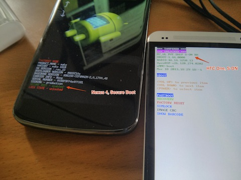

{{{
  "title" : "S-Off vs Unlocked, and flashing firmware",
  "date": "5-3-2013"
}}}

Earlier this week, I met with some of the folks on the HTCDev team in Seattle to talk about supporting CyanogenMod and root users/developers.

We had a chance to discuss some of the misperceptions of both sides, and the conversation was enlightening. On the ROM community's end, there seems to be a misunderstanding of what "S-OFF" means; as there are a few issues being conflated here. So much so, that they recently released [a S-OFF FAQ](http://www.htcdev.com/bootloader/about_unlock_process) on their HTCDev portal about it.

There are two distinct concepts here:

* Being able to flash a custom ROM (boot, recovery, system)
* Being able to flash the black box partitions (bootloader, radio, trustzone, etc). This also enables carrier unlock via SuperCID.

The term "S-OFF" is specific to HTC's bootloader, and is now being generically used and misnomered across all Android phones. The HTC Dev Unlock tool (as of the One) allows a user to flash the partitions that are interesting to custom ROMs. A full S-OFF turns off all security, allowing flashing of the radio and bootloader (and switch carriers). The latter bits are complete black boxes to all developers, and are generally not very interesting. Anyone that is involved with the radio stack, etc, are most likely employed by either Qualcomm, Samsung, etc. There is no "radio" development in the ROM community.

[In a previous post](https://plus.google.com/103583939320326217147/posts/WykbCAAVcrv), I stated the that "...the HTCDev unlock on this device actually behaves properly, unlike its predecessors. It behaves like a Nexus device."

The HTC One is not S-OFF. But neither are the Nexus devices (Secure Boot, good luck flashing a "custom" radio image).

To put things in perspective (and these are my/CyanogenMod's opinions); I'm not particularly concerned about devices being S-OFF. Even if they were, I wouldn't want to (or be able to) make changes to the radio anyways. I do want my phones to be unlocked so I can flash custom firmware, and I can do that.